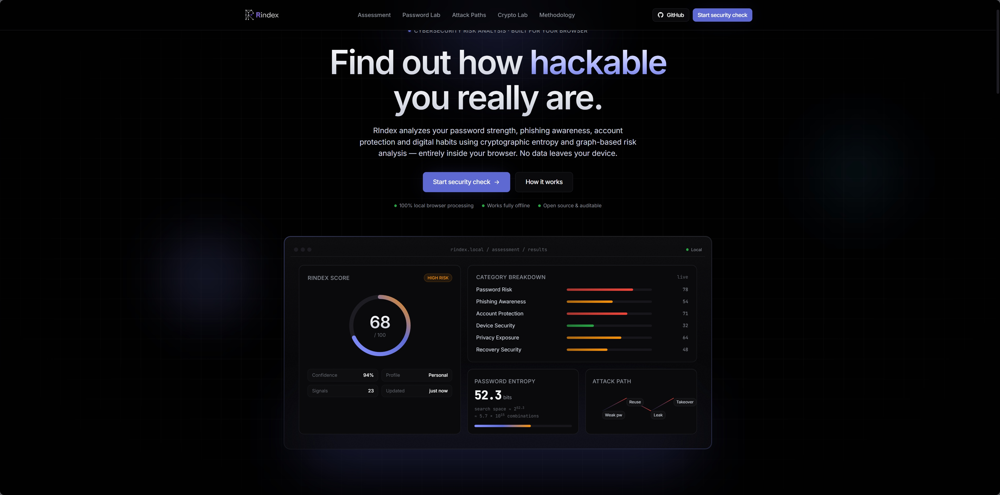
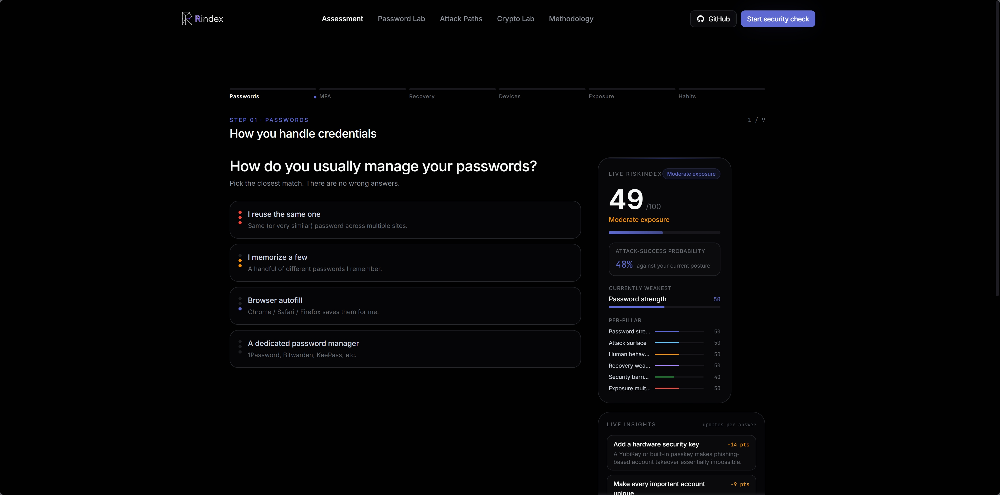
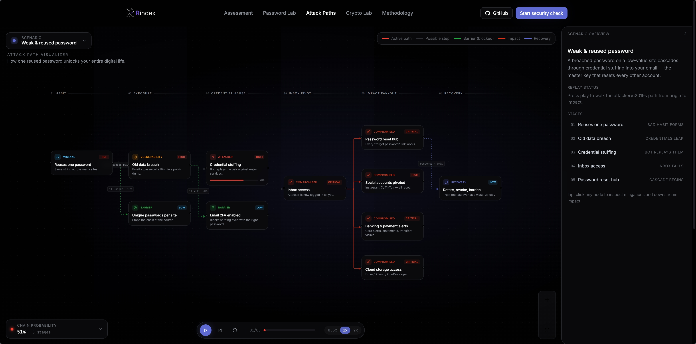
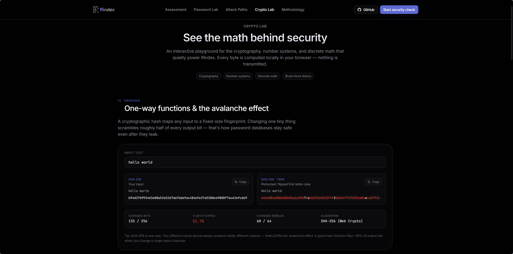

# RiskIndex (RIndex)

<div align="center">


### Analyze. Visualize. Understand Digital Risk.

RiskIndex is an interactive cybersecurity & digital-risk analysis platform built as a frontend-only web application using modern web technologies.

Designed as a school project with real-world product thinking, RiskIndex transforms complex security concepts into engaging visual simulations and risk analysis tools.

<br/>

🌐 **Website:** [rindex.tech](https://rindex.tech?utm_source=github.com)

</div>

---

# What is RiskIndex?

RiskIndex (short: **RIndex**) is a modern web application focused on answering one core question:

> **"How hackable are you?"**

Instead of being another boring password checker, RiskIndex turns cybersecurity concepts into interactive visual experiences.

The platform analyzes password strength, account exposure, attack chains, digital habits, and cryptographic weaknesses through simulations, graphs, animations, and educational tooling.

It combines:

* Cybersecurity education
* Risk analysis
* Interactive visualizations
* Mathematical concepts
* Modern UI/UX design

---

# Educational Purpose

This project was created to satisfy requirements involving practical applications of:

* Cryptography
* Discrete Mathematics
* Automata Theory
* Graph Theory

RiskIndex demonstrates these concepts through real interactive systems instead of static theory.

---

# Features

## Risk Profiler

Analyze:

* Password complexity
* Password entropy
* Reuse vulnerability
* Exposure risks
* Attack feasibility
* Human predictability patterns

The profiler visually explains:

* Why weak passwords fail
* How brute force scales
* Why reused credentials are dangerous
* How attackers chain leaks together

---

## Attack Chain Visualization

Interactive graph-based attack simulations showing how attackers move from:

* Email leaks
* Reused passwords
* Social engineering
* Public data exposure
* Weak authentication

Into:

* Full account compromise
* Identity exposure
* Financial damage
* Device access

Built using dynamic node systems and animated flow graphs.

---

## Crypto Lab

Interactive cryptography playground featuring:

* Hashing demonstrations
* Encoding systems
* Encryption concepts
* Password transformation visualizations
* Entropy explanations

Designed to make cryptography understandable visually instead of academically intimidating.

---

## Advanced Visualizations

Includes:

* Animated risk graphs
* Breach impact displays
* Entropy meters
* Probability visualizations
* Security scoring systems
* Interactive simulations

The goal is to maintain engagement even for users with short attention spans.

---

## Frontend Experience

RiskIndex focuses heavily on:

* Smooth animations
* Premium SaaS aesthetics
* Fast interactions
* Interactive storytelling
* Modern dark UI
* Motion-driven UX

Inspired by high-end modern product design systems.

---

# Tech Stack

## Core

* React
* TypeScript
* Vite
* Tailwind CSS

## Libraries

* Framer Motion
* React Flow
* Recharts

## Development Style

* AI-assisted development
* Structured repo guidance
* Prompt-engineered workflows
* Modular frontend architecture

---

# Screenshots

## Landing Page



---

## Risk Profiler



---

## Attack Visualization



---

## Crypto Lab



---

# Project Structure

```txt
RiskIndex/
├── docs/
│   ├── idea.md
│   ├── design.md
│   └── screenshots/
│
├── public/
│   └── brand/
│
├── src/
│   ├── components/
│   ├── pages/
│   ├── features/
│   ├── animations/
│   ├── data/
│   ├── hooks/
│   ├── utils/
│   └── styles/
│
├── copilot-instructions.md
└── README.md
```

---

# Running Locally

```bash
# Clone the repository
git clone https://github.com/YOUR_USERNAME/riskindex.git

# Open project
cd riskindex

# Install dependencies
npm install

# Start development server
npm run dev
```

---

# Design Philosophy

RiskIndex is intentionally designed to:

* Feel like a real startup product
* Keep users engaged visually
* Explain difficult concepts simply
* Avoid boring "school project" aesthetics
* Mix education with interactive experiences

The app prioritizes:

* Visual clarity
* Motion design
* Information hierarchy
* Fast comprehension
* Modern UI systems

---

# Privacy

RiskIndex performs analysis locally in the browser.

Users may optionally test real passwords, but:

* Nothing is uploaded
* No backend exists
* No password storage occurs
* Analysis is fully client-side

Safer alternatives are also provided for users uncomfortable using real credentials.

---

# Development

Created by Deyan Ilkov.

Built with a heavy focus on:

* UX experimentation
* Frontend architecture
* Cybersecurity education
* High-end visual polish

---

<div align="center">

### Risk isn't random. Understand it.

🌐 [rindex.tech](https://rindex.tech?utm_source=chatgpt.com)

</div>
